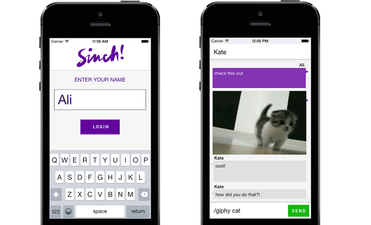
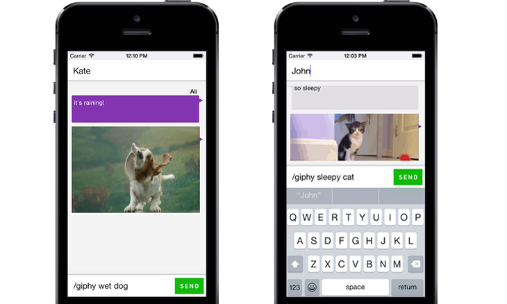

# Build an iOS Messaging App with Giphy

In this tutorial, we will be adding functionality to the [Sinch Instant Messaging](https://www.sinch.com/products/instant-messaging/) sample app to support GIF's, specifically using Giphy. In order to get the sample app, you will need to download the [Sinch SDK](https://www.sinch.com/downloads/). For this tutorial, you will need a basic understanding of the following areas:

* XCode
* Objective-C
* CocoaPods

The app will display a GIF from Giphy based on a search term when the user types "/giphy [text]".



Let's get started!

## 1. Setup

First, open up your **Podfile** and change it to look as follows:

```
xcodeproj 'SinchIM'

pod 'SinchService'
pod 'SinchRTC'
pod 'Giphy-iOS', '~> 0.1'
pod 'AFNetworking/Serialization', '~> 2.3.1'
pod 'AnimatedGIFImageSerialization', '~> 0.2.0'
```

We will be using a library called [Giphy-iOS](https://github.com/heyalexchoi/Giphy-iOS) developed by Github user Alex Choi.

Now, install the appropriate pods using `pod install` and open up the XCode workspace file.

If you haven't already done so, go to your [Sinch Dashboard](https://www.sinch.com/dashboard/) and create a new app. Fill out your app's application key and secret sections in **AppDelegate.m**.

## 2. Giphy Messages

Let's head to **MainViewController.m**. Add the following import statements to access the Giphy-iOS library.

```objective-c
#import <Giphy-iOS/AXCGiphy.h>
#import <AnimatedGIFImageSerialization/AnimatedGIFImageSerialization.h>
```

First, lets make sure we have enough room on the screen to display a GIF when the user types "/giphy [text]". Find the method `tableView:heightForRowAtIndexPath:` and add a few lines to make it look like this:

```objective-c
- (CGFloat)tableView:(UITableView *)tableView heightForRowAtIndexPath:(NSIndexPath *)indexPath {
    
    NSArray *entry = [_messages objectAtIndex:[indexPath row]];
    id<SINMessage> message = entry[0];
    NSString * messageText = message.text;
    if ([messageText rangeOfString:@"/giphy"].location != NSNotFound) {
    	return 205;
    }
    return 90;
}
```
Now head over to the method `tableView:cellForRowAtIndexPath:` and add the following if-statement just before the return-statement:

```objective-c
if ([message.text rangeOfString:@"/giphy"].location != NSNotFound)
{
    [AXCGiphy setGiphyAPIKey:kGiphyPublicAPIKey];
        
    NSArray *components = [message.text componentsSeparatedByString:@" "];
    NSRange range = NSMakeRange(1, [components count] - 1);
    NSArray *otherComponents = [components subarrayWithRange:range];
    NSString *query = [otherComponents componentsJoinedByString:@" "];
    [AXCGiphy giphyTranslationForTerm: query completion:^(AXCGiphy *result, NSError *error) {
           // 1
    }];
}
```

When we find that the user's message starts with the string "/giphy", we use the rest of the message to search Giphy for a GIF.

Once this action has completed, we want to display our resulting GIF. Do so by replacing the comment `//1` with the following code:

```objective-c
[[NSOperationQueue mainQueue] addOperationWithBlock:^{   

	NSURLRequest * request = [NSURLRequest requestWithURL:result.originalImage.url];
	[[[NSURLSession sharedSession] dataTaskWithRequest:request completionHandler:^(NSData *data, NSURLResponse *response, NSError *error) {

			UIImage * image = [UIImage imageWithData:data];
			[[NSOperationQueue mainQueue] addOperationWithBlock:^{
				UIImageView* imgv = [[UIImageView alloc] initWithImage:image];
				imgv.frame =CGRectMake(10, 5, cell.frame.size.width-24, 200);
				[cell addSubview:imgv];
			}];

	}] resume];

}];
```

That's it! Try it out to see if everything works the way that it should.



You can see that Sinch IM is simple to use. This makes it easier to customize your app's in-app messaging features. To find more tutorials, head over the the [Sinch Tutorial Site](https://www.sinch.com/tutorials/) or the [Sinch Github](https://github.com/sinch). 
